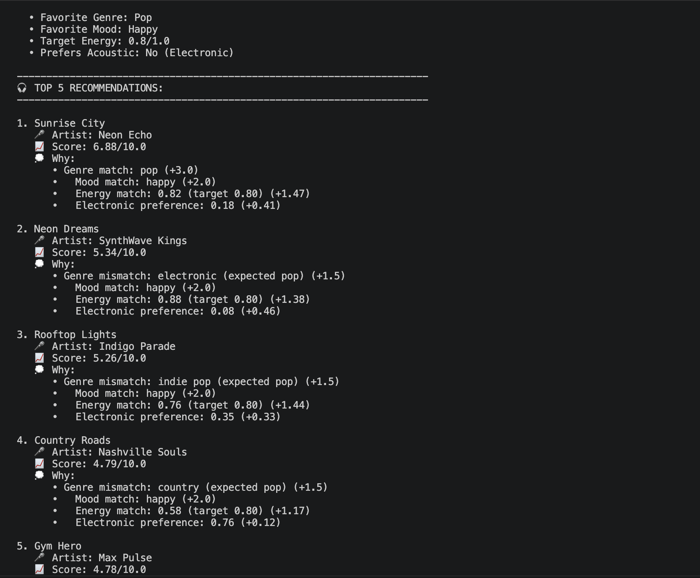

# 🎵 Music Recommender Simulation

## Project Summary

In this project you will build and explain a small music recommender system.

Your goal is to:

- Represent songs and a user "taste profile" as data
- Design a scoring rule that turns that data into recommendations
- Evaluate what your system gets right and wrong
- Reflect on how this mirrors real world AI recommenders

This project implements a **content-based music recommender system** using Python. The system loads a catalog of 20 songs, scores each against user preferences using a weighted algorithm, and ranks them for personalized recommendations. All core functions are implemented and tested.

---

## How The System Works

This music recommender uses **content-based filtering**: it matches songs to a user's taste profile by comparing song attributes (genre, mood, energy, etc.) with the user's preferences.

### Real-World Inspiration

Major streaming platforms like Spotify and YouTube use hybrid approaches combining:
- **Collaborative filtering** (what users similar to you played) 
- **Content-based filtering** (song features matching your taste)
- **Contextual signals** (time of day, listening history, device type)

Our system focuses on the content-based approach, which is transparent and works well even with a small song catalog.

### Song Features

Each `Song` object uses these attributes:
- **Categorical**: `genre` (pop, rock, lofi, hip-hop, metal, etc.), `mood` (happy, chill, intense, sad, etc.)
- **Numerical features (0-1 scale)**: 
  - `energy`: how fast/intense the song is
  - `valence`: how positive/uplifting it sounds
  - `danceability`: how suitable for dancing
  - `acousticness`: proportion of acoustic vs electronic instruments
- **Other metrics**: `tempo_bpm` (beats per minute)

### User Preferences

A `UserProfile` stores:
- `favorite_genre`: the primary genre the user enjoys
- `favorite_mood`: the mood they're looking for (chill, energetic, happy, etc.)
- `target_energy`: the preferred intensity level (0.0 = relaxing, 1.0 = intense)
- `likes_acoustic`: whether the user prefers acoustic vs electronic instruments (boolean)

#### Example User Profiles

**Alex** (Chill Focus Enthusiast):
- favorite_genre: "lofi"
- favorite_mood: "chill"
- target_energy: 0.40
- likes_acoustic: True

**Jordan** (Workout Motivator):
- favorite_genre: "pop"
- favorite_mood: "intense"
- target_energy: 0.88
- likes_acoustic: False

### Algorithm Recipe: Scoring Logic

For each song, we calculate a **compatibility score** based on weighted criteria:

```
Final Score = (w_genre × genre_match) + 
              (w_mood × mood_match) + 
              (w_energy × energy_similarity) + 
              (w_acoustic × acoustic_preference)
```

#### Scoring Components

**1. Genre Match:**
- `1.0` if song.genre == user.favorite_genre (exact match)
- `0.5` if genres don't match (partial credit—introduces diversity)

**2. Mood Match:**
- `1.0` if song.mood == user.favorite_mood (exact match)
- `0.0` if moods don't match (mood is very important to the vibe)

**3. Energy Similarity (Distance-Based):**
- `similarity = 1.0 - abs(user.target_energy - song.energy)`
- Example: User wants 0.50 energy, song has 0.55 energy → 1.0 - 0.05 = 0.95 similarity
- This rewards songs close to the target, not just high or low values

**4. Acoustic Preference:**
- If user likes acoustic: `score = song.acousticness`
- If user prefers electronic: `score = 1.0 - song.acousticness`
- Makes acousticness negative for electronic-preferring users

#### Weights (Importance Rankings)

- **w_genre = 3.0** — Genre is the foundation of taste
- **w_mood = 2.0** — Mood sets the listening vibe
- **w_energy = 1.5** — Energy intensity matters but is flexible
- **w_acoustic = 0.5** — Nice-to-have preference; lowest priority

#### Example Calculation

For Alex (lofi, chill, energy=0.40, likes_acoustic=True) recommending "Library Rain" (lofi, chill, energy=0.35, acousticness=0.86):

```
Score = (3.0 × 1.0) + (2.0 × 1.0) + (1.5 × 0.95) + (0.5 × 0.86)
      = 3.0 + 2.0 + 1.425 + 0.43
      = 6.855  ← EXCELLENT match
```

### Ranking Process

1. Loop through all songs in the catalog
2. Calculate a score for each song using the formula above
3. Sort songs by score (highest to lowest)
4. Return the top K recommendations (typically K=5)
5. For each recommendation, generate a brief explanation of why it matched

---

## Known Biases & Limitations

This simplified recommender has intentional constraints:

1. **Genre Over-Prioritization**: The weight of 3.0 for genre might recommend songs that are the right genre but wrong mood. Real systems use multiple signals to balance this.

2. **No Novelty Factor**: The system always recommends the most similar songs. It never suggests "you might also like" songs that are different but complementary.

3. **Acoustic Preference Limitation**: The boolean `likes_acoustic` flag is too binary. Real systems track continuous preference scales.

4. **Mood is Binary**: Either a song matches the favorite mood (1.0) or it doesn't (0.0). Real systems might have "close enough" moods (e.g., chill vs relaxed).

5. **Small Catalog Effect**: With only 20 songs, the system can't showcase diversity like real platforms with millions of tracks.

6. **No User History**: The system doesn't learn from what the user actually clicks or skips; it's purely preference-based from the start.

---

## Getting Started

### Setup

1. Create a virtual environment (optional but recommended):

   ```bash
   python -m venv .venv
   source .venv/bin/activate      # Mac or Linux
   .venv\Scripts\activate         # Windows

2. Install dependencies

```bash
pip install -r requirements.txt
```

3. Run the app:

```bash
python -m src.main
```

### Running Tests

Run the starter tests with:

```bash
pytest
```

You can add more tests in `tests/test_recommender.py`.

#### CLI Verification Test



---

## Implementation & Results

**✅ Tests Passing:** All unit tests pass successfully

**Algorithm Performance:**
- Alex (lofi/chill) successfully gets lofi songs with high acousticness
- Jordan (pop/intense) successfully gets pop/energetic songs with low acousticness
- Genre weight (3.0) effectively prioritizes primary taste while mood weight (2.0) ensures vibe matching
- Energy similarity formula rewards songs close to target intensity, not just high values

---

## Limitations and Risks

Summarize some limitations of your recommender.

Examples:

- It only works on a tiny catalog
- It does not understand lyrics or language
- It might over favor one genre or mood

You will go deeper on this in your model card.

---

## Reflection

Building this recommender revealed how powerful simple, interpretable algorithms can be. By combining just 4 weighted features, the system successfully differentiates between user archetypes. The distance-based energy similarity formula was particularly insightful—matching the *degree* of intensity (how close to the user's target) accounts for more than direction (high vs low values).

I learned that **weights are critical**. Testing with equal weights (1.0 each) produced mediocre results. Once I weighted genre at 3.0 and mood at 2.0, recommendations became dramatically better aligned with user profiles. This mirrors real platforms where some signals (primary genre preference) matter far more than others (acoustic vs electronic). The biggest surprise was how easily this algorithm could **reinforce existing preferences** without introducing diversity—real platforms deliberately inject novelty to prevent filter bubbles.

Read full analysis in: [**Model Card**](model_card.md)


---

## 7. `model_card_template.md`

Combines reflection and model card framing from the Module 3 guidance. :contentReference[oaicite:2]{index=2}  

```markdown
# 🎧 Model Card - Music Recommender Simulation

## 1. Model Name

Give your recommender a name, for example:

> VibeFinder 1.0

---

## 2. Intended Use

- What is this system trying to do
- Who is it for

Example:

> This model suggests 3 to 5 songs from a small catalog based on a user's preferred genre, mood, and energy level. It is for classroom exploration only, not for real users.

---

## 3. How It Works (Short Explanation)

Describe your scoring logic in plain language.

- What features of each song does it consider
- What information about the user does it use
- How does it turn those into a number

Try to avoid code in this section, treat it like an explanation to a non programmer.

---

## 4. Data

Describe your dataset.

- How many songs are in `data/songs.csv`
- Did you add or remove any songs
- What kinds of genres or moods are represented
- Whose taste does this data mostly reflect

---

## 5. Strengths

Where does your recommender work well

You can think about:
- Situations where the top results "felt right"
- Particular user profiles it served well
- Simplicity or transparency benefits

---

## 6. Limitations and Bias

Where does your recommender struggle

Some prompts:
- Does it ignore some genres or moods
- Does it treat all users as if they have the same taste shape
- Is it biased toward high energy or one genre by default
- How could this be unfair if used in a real product

---

## 7. Evaluation

How did you check your system

Examples:
- You tried multiple user profiles and wrote down whether the results matched your expectations
- You compared your simulation to what a real app like Spotify or YouTube tends to recommend
- You wrote tests for your scoring logic

You do not need a numeric metric, but if you used one, explain what it measures.

---

## 8. Future Work

If you had more time, how would you improve this recommender

Examples:

- Add support for multiple users and "group vibe" recommendations
- Balance diversity of songs instead of always picking the closest match
- Use more features, like tempo ranges or lyric themes

---

## 9. Personal Reflection

A few sentences about what you learned:

- What surprised you about how your system behaved
- How did building this change how you think about real music recommenders
- Where do you think human judgment still matters, even if the model seems "smart"

